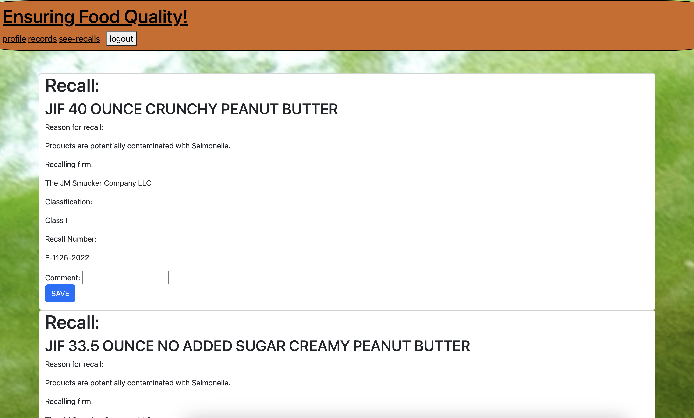

# Project 2: No Crude Food

## Description

This application is a tool for Restaurants and other businesses which sell food to keep track of any food recalls which impact their business.  Restaurant owners will be able to create an account, and input the manufacturers which they buy from, and will then be presented with any food recalls which are associated with their chosen manufacturers.  This application alerts users to information necessary for customer safety, and allows them an opportunity to track their responses to food recalls which impact the restaurant.  User responses to these recalls are stored to the user's account, and can be accessed as records of the restaurant's acknowledgement and subsequent action to protect customer safety.
Through building this full-stack application, our team had the opportunity to practice and refine many skills.  We practiced building an application using the MVC paradigm.  We used sequelize models to store, create, access, and delete data, and used express-Handlebars to dynamically display data for our users.  We used express routing to create paths for HTTP requests to our own server, and used javascript functionality to make fetch requests to our API, as well as the FDA's API.  We practiced creating authentication for logging in our users, and protecting their data with brcypt's password hashing.  We also protected our own data with environment variables, using the dotenv package.

## Installation

This application is deployed on Heroku, but if you'd like to clone the gitHub repository yourself and run the application locally, below are instructions for doing so:
First, run "npm install" to install the project's dependencies through Node.
You will need to set up a .env file with your database's information and login, as well as your own session secret.
Then, from the terminal in the db folder, run "mysql -u root -p" and enter your password.
Next, run "source schema.sql" to set up our database.
After that, you can move back into the project's main folder, and run "node seeds/seed.js" to seed data into the database.  To start the appliation, run "node server.js" in the terminal.  You'll be able to access the site at localhost:3001

## Usage

This application is deployed at https://aqueous-thicket-19245.herokuapp.com/
Upon opening the site, you will be prompted to click into the login page.  There, new users can sign up for an account, and existing users can log in to their accounts.  Users will then be redirected to their profile page, where they can add new manufacturers to be associated with their account, or delete any manufacturers they are no longer relying on.  From there, users can click to see any recalls associated with their manufacturers, or to see any saved records associated with their account.  When viewing their manufacturers' recalls, a user can choose to save any relevant recalls to their account, and to save a comment with that information to record how they chose to address the recall.  This data will be saved and accessible on the user's records page for later reference, for the restaurant's own record keeping, or as proof of their having acknowledged and handled existing food safety concerns.

## Credits

This project was a collaboration between David Cheptegei (gitHub: Cheptegei-create), Alex Wiederman (AlexWiederman), Reinaldo Santana (Naldo47), Aviva Rubenstein (AvivaRubenstein), and Josh Musto (joshmusto).
This application used the MYSQL2 package, sequelize, bcrypt, dotenv, express, express-handlebars, and express-session.  

## License

See LICENSE.TXT file in repository.

---